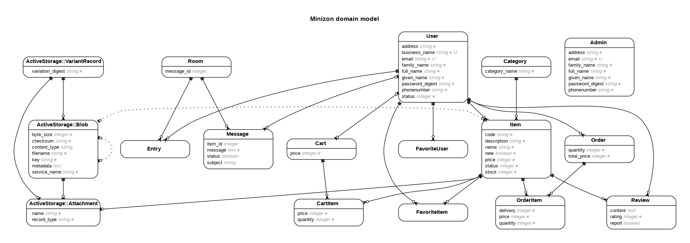

# Minizon

Minizon は、某サービスをイメージして作成したECサイトのWebアプリケーションです。 
出品者・購入者・管理者の 3 ロールを持ちます。
商品出品、検索、お気に入り、レビュー、カート、注文機能などを実装しました。

## 主な機能

- 認証・アカウント管理
	- ログイン・ログアウト
	- アカウント情報編集、パスワード更新
- 商品関連機能
	- 商品一覧・詳細表示
	- 商品検索
	- 商品出品・編集・削除
	- お気に入り
- 購入機能
	- カート投入・数量管理
	- 注文作成、注文アイテム管理
	- 返品・キャンセルの状態更新
- レビュー機能
	- 商品レビュー投稿
	- レビュー通報
- 管理機能（Admin）
	- ユーザー / 商品 / 注文 / レビュー / カテゴリ管理

## 技術スタック

- Backend: Ruby 3.1.6, Ruby on Rails 7
- Database: SQLite3
- Auth: `bcrypt`
- Pagination: `kaminari`, `kaminari-i18n`
- Image Upload: Active Storage, `image_processing`, `mini_magick`
- i18n: `rails-i18n`
- Development: `better_errors`, `binding_of_caller`

## データベース設計

## 設計上の工夫

- ロール別ルーティング
	- `admin` / `seller` 名前空間を分離し、ロールごとに画面と操作範囲を整理
- 整合性の維持
	- `CartItem` の保存・削除時にカート合計金額を再計算して、表示とデータのズレを防止
- 運用を意識した機能
	- レビュー通報、管理者向け検索・管理機能

## ルーティング

- Public: 商品閲覧、レビュー、カート、注文、メッセージ
- Seller: 出品者向け管理（商品 / 注文 / レビュー / ユーザー）
- Admin: 管理者向け管理（ユーザー / 商品 / 注文 / カテゴリ / レビュー / ルーム）
